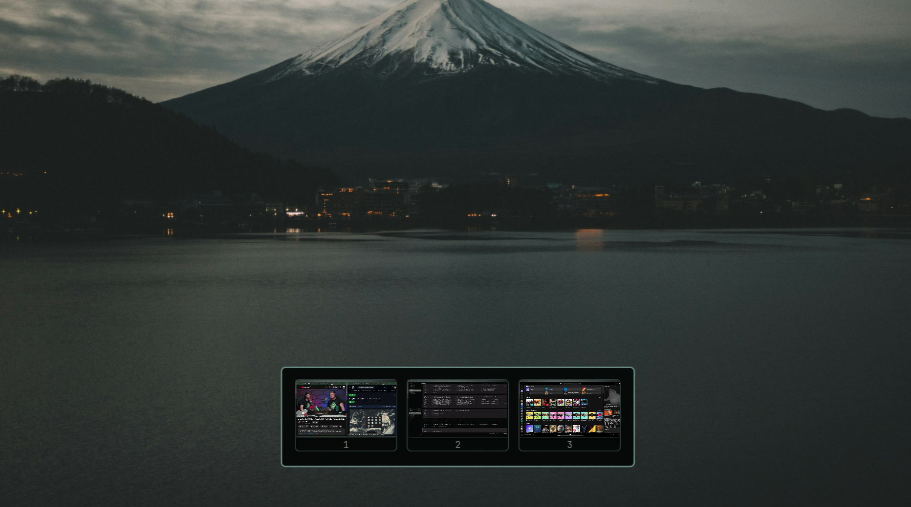

# Omarchy Workspace Overview

Preview your Hyprland workspaces while switching.



## Features

- Shows only workspaces containing windows
- Recreates tiled and floating window layouts from Hyprland geometry
- Highlights the focused workspace using the active Omarchy theme
- Uses the current wallpaper, colors, typography, spacing, and corner radius
- Follows the focused monitor and avoids a bottom-positioned Omarchy bar
- Opens on workspace switch or by touching the bottom edge of the focused monitor
- Click a workspace to switch to it; the overview stays open while your pointer is over it
- Captures one still frame per window, then releases all capture sources when hidden
- Debounces rapid workspace changes and performs no capture work while idle

## Requirements

- Omarchy Quattro
- Hyprland and Quickshell as provided by Omarchy

There are no external dependencies, privileged operations, background services, or network requests.

## Install

```sh
omarchy plugin add https://github.com/pablopunk/omarchy-workspace-overview.git --enable
```

The plugin starts automatically and appears briefly after the focused Hyprland workspace changes, or when the pointer touches the bottom edge of the focused monitor.

## Configure

The defaults are defined near the top of `WorkspaceOverview.qml`:

- `duration`: visibility in milliseconds, default `1300`
- `cardWidth`: preferred workspace card width
- `cardGap`: spacing between workspace cards
- `panelMargin`: distance from the bottom screen edge
- `edgeEnabled`: whether the bottom hover trigger is active, default `true`
- `edgeHeight`: height of the invisible bottom hover strip

User plugin files live at:

```text
~/.config/omarchy/plugins/pablopunk.workspace-overview/
```

Restart the shell after changing plugin code:

```sh
omarchy restart shell
```

## Commands

```sh
omarchy-shell workspace-overview open
omarchy-shell workspace-overview close
omarchy-shell workspace-overview toggle
omarchy-shell workspace-overview state
```

## Remove

```sh
omarchy plugin remove pablopunk.workspace-overview
```

## Performance

The plugin never runs live video captures. When opened, it requests one thumbnail-sized frame for each visible window. Capture sources are cleared as soon as the overlay closes, leaving no ongoing compositor or GPU work.

## License

[MIT](LICENSE)
